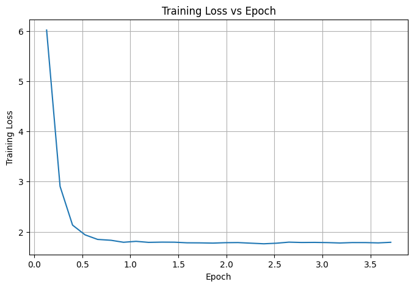
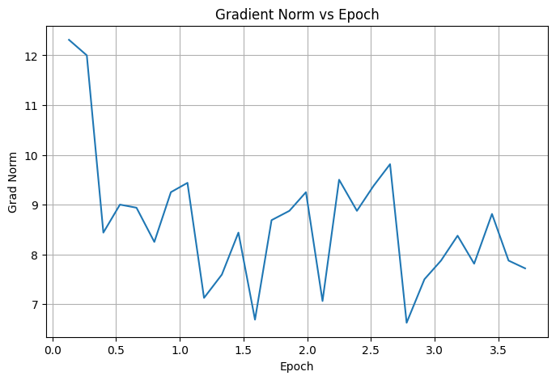
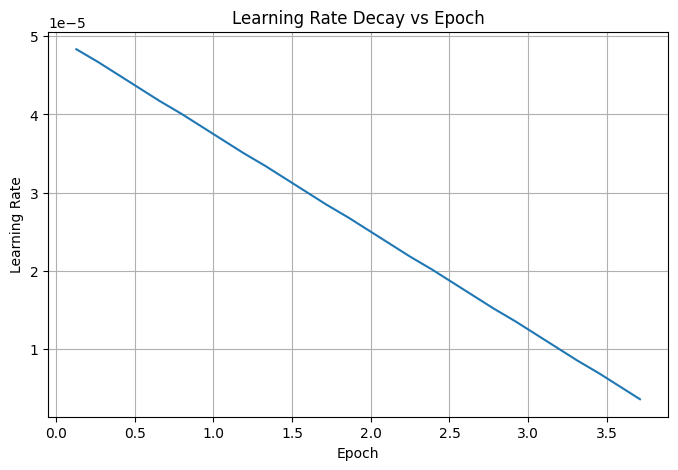
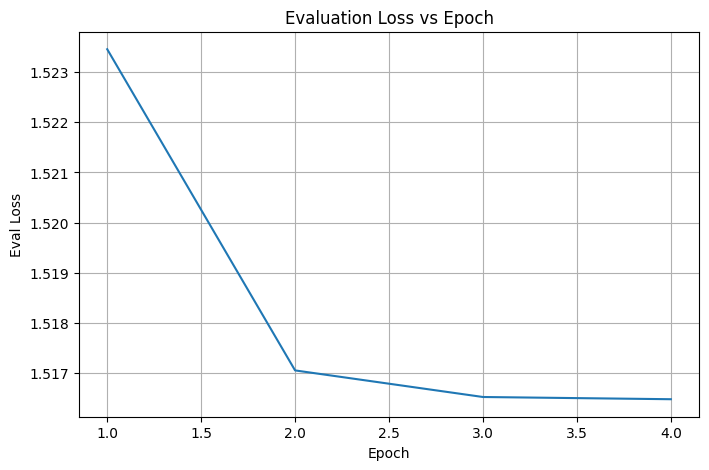
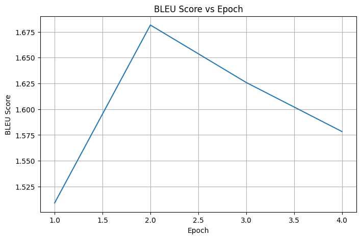
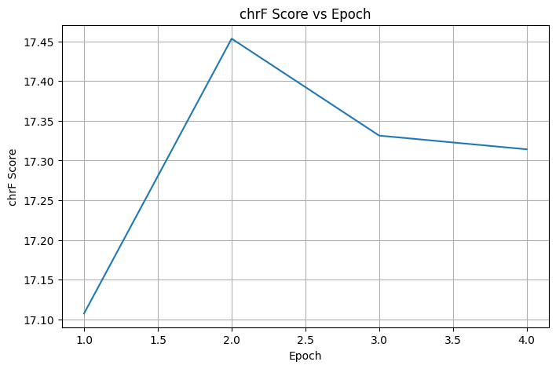

# AgrEs Tanslation Model

## Fine-tuning de NLLB-200 (Meta) — Quechua Proxy v1 & Awajún Token v2

Este repositorio contiene los experimentos para entrenar modelos de traducción *bidireccional* **Español ↔ Awajún** usando **fine-tuning sobre NLLB-200**.  
Incluye dos enfoques:

- **Quechua Proxy v1:** NLLB-200 no incluye un tag nativo para Awajún, por lo que se utilizó el tag de Quechua como proxy. Se obtuvieron métricas bajas.  
- **Awajún Token v2:** se creó un **token/tag propio para Awajún**, obteniendo mayor estabilidad y mejor aprendizaje. Esta es la versión principal del proyecto.

---

## 📦 Dataset

- **Total de frases:** *+16k*  
- **Paralelo y bidireccional**: Español ↔ Awajún.  
- **Tags utilizados:**  
  - `>>spa_Latn<<` = Español  
  - `>>agr_Latn<<` = token personalizado Awajún  
- **Split:**  
  - Train: **90%**  
  - Test: **10%**

---

## 🚀 Instalación y Ejecución del Proyecto

### 1. Clonar el repositorio

    ```bash
    git clone https://github.com/Piero010405/AgrEs-translation-model.git
    cd AgrEs-translation-model
    ```

### 2. Levantar el entorno y ejecutar el Pipeline

Este proyecto incluye un contenedor para un entorno aislado de entrenamiento.
    1. Construir la imagen
    ```bash
    docker build -t agres-model .
    ```

    2. Ejecutar el contenedor
    ```bash
    docker run -it --gpus all -v $(pwd):/workspace agres-model bash
    ```

    3. Ejecutar el script de preparación
    ```bash
    python scripts/prepare_data.py
    ```

    4. Ejecutar entrenamiento
    ```bash
    python scripts/train.py
    ```

---

## 📊 Resultados del Modelo

### 📊 Métricas — Quechua Proxy v1

El proxy no produjo métricas altas, lo que motivó crear un token personalizado Awajún.






